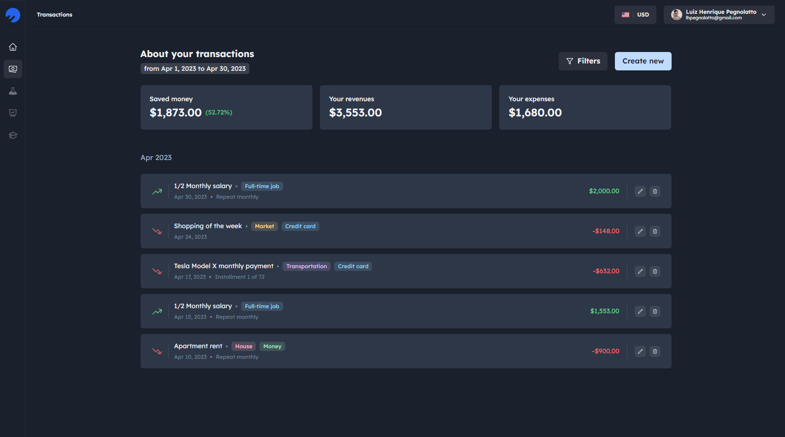

<br />
<div align="center">
  <a href="https://github.com/lhpegnolatto/plutto">
    
  </a>

  <h3 align="center">Plutto</h3>

  <p align="center">
    A simple personal finance helper for organizing and planning expenses.
    <br />
    <a href="https://plutto.com.br"><strong>Explore the app »</strong></a>
    <br />
    <br />
    <a href="https://github.com/lhpegnolatto/plutto/issues">Report Bug</a>
    ·
    <a href="https://github.com/lhpegnolatto/plutto/issues">Request Feature</a>
  </p>
</div>
<br />

## About The Project



This project aims to help people manage their personal finances in a simple and accessible way. With it, you can register your expenses and income and obtain metrics and insights about your finances.

The main focus of this project is simplicity and ease of use. It is designed to be accessible to everyone, regardless of their financial or technical knowledge. Additionally, the project is free and open source, which means that anyone can use it and contribute to its improvement.

### Built With

- [](https://nextjs.org/)
- [](https://react.dev/)
- [](https://www.typescriptlang.org/)
- [](https://chakra-ui.com/)
- [](https://supabase.com/)

<!-- GETTING STARTED -->

## Getting Started

_Below is an example of how you can instruct your audience on installing and setting up your app. This template doesn't rely on any external dependencies or services._

1. Get a free supabase app at [https://supabase.com](https://supabase.com). (I'm working to improve how can I provide the project schema for everyone)
2. Clone the repo
   ```sh
   git clone https://github.com/lhpegnolatto/plutto.git
   ```
3. Install NPM packages
   ```sh
   yarn
   ```
4. Create a `env.local` file in your root folder, and follow the `env.example` file to enter your own supabase credentials
5. And finally run
   ```sh
   yarn dev
   ```

## Contributing

Contributions are what make the open source community such an amazing place to learn, inspire, and create. Any contributions you make are **greatly appreciated**.

If you have a suggestion that would make this better, please fork the repo and create a pull request. You can also simply open an issue with the tag "enhancement".
Don't forget to give the project a star! Thanks again!

1. Fork the Project
2. Create your Feature Branch (`git checkout -b feature/amazing-feature`)
3. Commit your Changes (`git commit -m 'feat: adding amazing things'`)
4. Push to the Branch (`git push origin feature/amazing-feature`)
5. Open a Pull Request

## License

Distributed under the MIT License. See `LICENSE.md` for more information.
